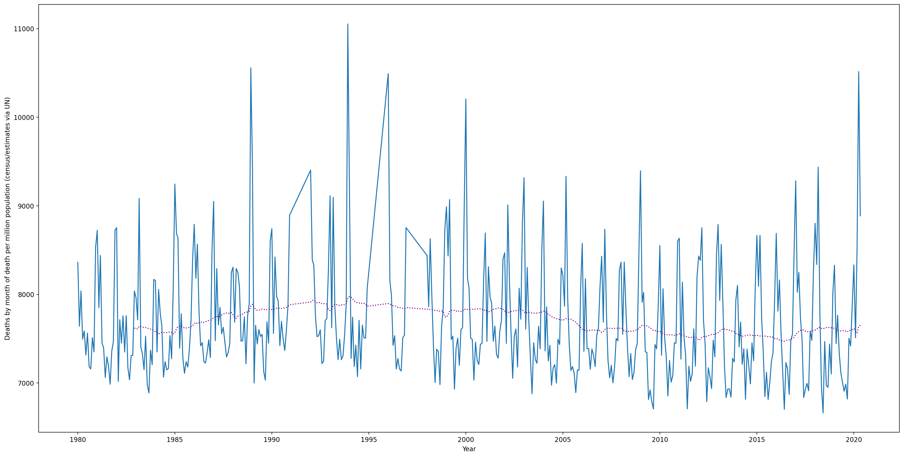

# Swedish mortality statistics

Attempting to reproduce [this](https://twitter.com/mmay3r/status/1304837380193488896)
plot of Sweden's "deaths per Month / per Million population" from 1980 to 2020,
I followed the link given on the chart to [[the Swedish stats authority](https://en.wikipedia.org/wiki/Statistics_Sweden)] [statistikdatabasen.scb.se](https://www.statistikdatabasen.scb.se/pxweb/en/ssd/)
but could only obtain

> Mortality rate per 1,000 of the mean population by age and sex. Year 2000 - 2019

This could be supplemented with the 2020 figures to reproduce the plot.

- Weekly figures up to week 31 are available [via Statista](https://www.statista.com/statistics/1115707/sweden-number-of-deaths-per-week/)
  and were manually entered into a TSV [via spreadsheet]
- Months were added to correspond the week of the year to its calendar month
  - For a week bridging 2 months, it was marked as the month in which it has the majority of days
- Week 32 was the first week in month 8 (August), starting on Monday August 3rd
  - Since this is the most recent time point, and the only available time point for
    the month of August, it must be omitted when comparing months to previous years

However, on this data alone I cannot reproduce the chart as the data are annual!

Searching the web for _"sweden monthly deaths 1980"_
led me to the UNData site which goes back to 1980 and is presumably the true source
of these figures:
- ["Deaths by month of death"](http://data.un.org/Data.aspx?d=POP&f=tableCode%3A65)
- ["Population by age..."](http://data.un.org/Data.aspx?d=POP&f=tableCode%3a22)

- These are preprocessed in `preproc/` by `preprocess_UN_monthly_stats_sweden.py`
  - Other countries' data are not strictly monthly so the rest are not processed (yet!)
- The source files of data which were preprocessed are in `preproc/data/` along with some
  other data files which were not used in the end

Finished result:

